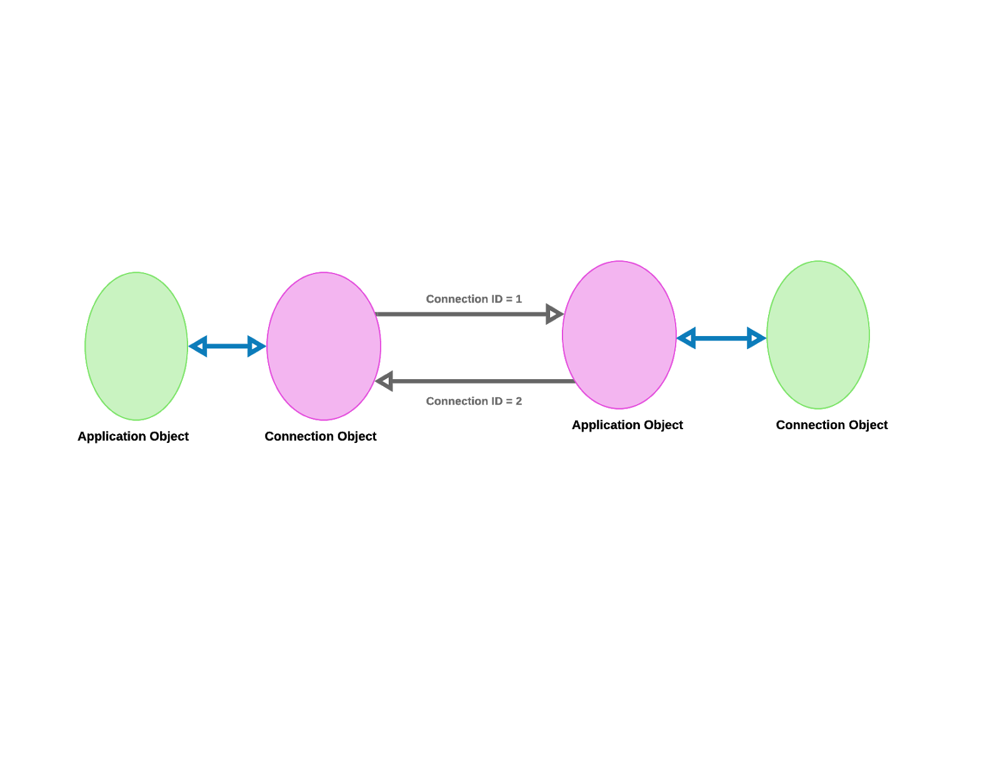

<h2>Getting Started<h2>

<h3>Le protocol cip :<h3>

Le CIP (Control and Information Protocol) est un protocole orienté objet peer-to-peer qui fournit des connexions entre des appareils industriels (capteurs, actionneurs) et des appareils de niveau supérieur (contrôleurs). Le CIP est indépendant du support physique et de la couche liaison de données.

CIP a été conçu pour répondre aux exigences de l'industrie de l'automatisation. La spécification (qui est maintenue par l'Open Devicenet Vendors Association - ODVA) décrit les caractéristiques suivantes: 
 
Object modelling

*   Messaging protocol
*   Communication objects
*   General object library
*   Device profiles
*   Device configuration
*   Services
*   Data management

Nous allons se focaliser sur les premiers trois points.

<h3>**CIP OBJECT MODELING : 
**<h3>

CIP utilise une approche orientée objet pour modéliser les nœuds et les services de communication sur un réseau CIP. 

Chaque nœud est modélisé comme une collection d'objets. Un objet représente un élément ou un composant particulier au sein d'un nœud. Chaque objet appartient à une classe d'objets qui partagent le même ensemble d'attributs et implémentent les mêmes comportements. Un objet est une instance de cette classe, avec son propre ensemble unique de valeurs d'attribut. Un noeud peut contenir plusieurs objets de la même classe. Les nœuds et les objets à partir desquels ils sont constitués utilisent un schéma d'adressage standard comprenant les éléments suivants:

*   ID MAC - attribué à chaque nœud d'un réseau CIP
*   ID de classe - attribué à chaque classe d'objets sur le réseau
*   ID d'instance - attribué à une instance (objet) spécifique d'une classe
*   ID d'attribut - attribué à un attribut d'une classe ou d'un objet
*   Code de service - identifie un comportement spécifique d'une classe ou d'un objet

**Address Ranges:** 
Cette partie présente les plages définies par CIP pour les informations d'adressage d'objet présentées dans la section précédente.  
 
Les termes suivants sont utilisés lors de la définition des plages: 

*   **Open** - Une plage de valeurs dont la signification est définie par ODVA  CI et sont communs à tous les participants CIP 
*    **Vendor Specific** - Une plage de valeurs spécifiques au fournisseur d'un périphérique. Ceux-ci sont utilisés par les fournisseurs pour étendre leurs appareils au-delà des options Open disponibles. un **Vendor** gère en interne l'utilisation des valeurs de cette plage 
*   **Object Class Specific** - Une plage de valeurs dont la signification est définie par une ObjectClass. Cette plage s'applique aux définitions de code de service

**Class ID Ranges:**

<table>
  <tr>
   <td><strong>INTERVAL<strong>
   <td>
   <td><strong>UTILISATION<strong>
   <td>
  <tr>
  <tr>
   <td>0x00 - 0x63
   <td>
   <td>CIP Common
   <td>
  <tr>
  <tr>
   <td>0x64 - 0xC7
   <td>
   <td>Vendor Specific
   <td>
  <tr>
  <tr>
   <td>0xC8 - 0xFF
   <td>
   <td>Reserved by ODVACI for future use
   <td>
  <tr>
  <tr>
   <td>0xF0 - 0x2FF
   <td>
   <td>CIP Common
   <td>
  <tr>
  <tr>
   <td>0x300 - 0x4FF
   <td>
   <td>Vendor specific
   <td>
  <tr>
  <tr>
   <td>0x500 - 0xFFFF
   <td>
   <td>Reserved by ODVACI for future use
   <td>
  <tr>
<table>

**Service Code Ranges:**

<table>
  <tr>
   <td><strong>INTERVAL<strong>
   <td>
   <td><strong>UTILISATION<strong>
   <td>
  <tr>
  <tr>
   <td>0x00 - 0x31
   <td>
   <td>CIP Common - referred to cip common services
   <td>
  <tr>
  <tr>
   <td>0x32 - 0x4A
   <td>
   <td>Vendor Specific
   <td>
  <tr>
  <tr>
   <td>0x4B - 0x63
   <td>
   <td>Object Class Specific
   <td>
  <tr>
  <tr>
   <td>0x64 - 0x7F
   <td>
   <td>Reserved by ODVACI for future use
   <td>
  <tr>
  <tr>
   <td>0x80 - 0xFF
   <td>
   <td>Invalid  Not used
   <td>
  <tr>
<table>

**Attribute ID Ranges:**

<table>
  <tr>
   <td><strong>INTERVAL<strong>
   <td>
   <td><strong>UTILISATION<strong>
   <td>
  <tr>
  <tr>
   <td>0x00 - 0x63
   <td>
   <td>CIP Common - 
   <td>
  <tr>
  <tr>
   <td>0x64 - 0xC7
   <td>
   <td>Vendor Specific
   <td>
  <tr>
  <tr>
   <td>0xC8 - 0xFF
   <td>
   <td>Reserved by ODVACI for future use
   <td>
  <tr>
<table>

<h2>**MESSAGING PROTOCOL :**<h2>

Une connexion CIP fournit un chemin de communication entre plusieurs points d'extrémité. Les points de terminaison d'une connexion sont des applications qui doivent partager des données. Les transmissions associées à une connexion particulière reçoivent une valeur d'identification lorsqu'une connexion est établie. Cette valeur d'identification est appelée l'ID de connexion (CID). 

 
**Connected Objects** modélise les caractéristiques de communication d'une relation particulière Application-to-Application (s). Le terme point de terminaison fait référence à l'une des entités communicantes impliquées dans une connexion.  
 
Le CIP définit un moyen dynamique par lequel les deux types de connexions suivants peuvent être établis : **IO Connections et Explicit Messaging Connections** .

<h3>Le Implicit et le Explicite Messaging :<h3>

*   **IO Connections** : il est souvent appelée implicite message, son rôle est de fournir une special-purpose communication entre le producer et le consumer. 
Un message d' **IO** se compose d'un ID de connexion et des données **IO **associées. La signification des données dans un message d'**IO** est impliquée par l'ID de connexion associé. Les points d'extrémité de connexion sont supposés avoir une connaissance de l'utilisation du message d'**IO**. 

*   **Explicit Messaging Connections** :  
son rôle est de fournir une multi-purpose communication entre deux noeuds, les messages explicites fournissent les communications réseau request  réponse. typiques orientées. 
La messagerie explicite fournit les moyens par lesquels les fonctions typiques orientées demande  réponse sont exécutées. 
 CIP définit un protocole de messagerie explicite qui indique la signification du message. 
 Un Explicit Message se compose d'un ID de connexion et des informations de protocole de messagerie associées. 

 

