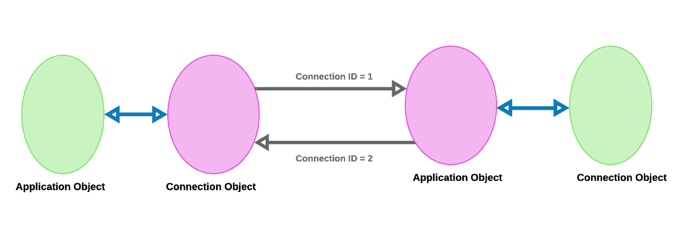
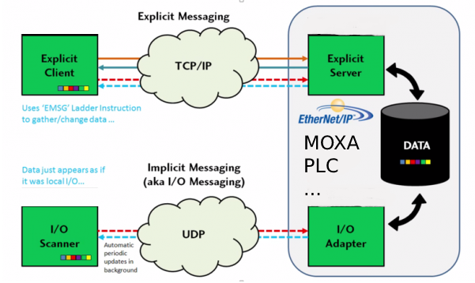

## **Le protocol cip ** 

Le CIP (Control and Information Protocol) est un protocole orienté objet peer-to-peer qui fournit des connexions entre des appareils industriels (capteurs, actionneurs) et des appareils de niveau supérieur (contrôleurs). Le CIP est indépendant du support physique et de la couche liaison de données.

CIP a été conçu pour répondre aux exigences de l'industrie de l'automatisation. La spécification (qui est maintenue par l'Open Devicenet Vendors Association - ODVA) décrit les caractéristiques suivantes: 
 
Object modelling

*   Messaging protocol
*   Communication objects
*   General object library
*   Device profiles
*   Device configuration
*   Services
*   Data management

Nous allons se focaliser sur les premiers trois points.

## ** CIP OBJECT MODELING  **

CIP utilise une approche orientée objet pour modéliser les nœuds et les services de communication sur un réseau CIP. 

Chaque nœud est modélisé comme une collection d'objets. Un objet représente un élément ou un composant particulier au sein d'un nœud. Chaque objet appartient à une classe d'objets qui partagent le même ensemble d'attributs et implémentent les mêmes comportements. Un objet est une instance de cette classe, avec son propre ensemble unique de valeurs d'attribut. Un noeud peut contenir plusieurs objets de la même classe. Les nœuds et les objets à partir desquels ils sont constitués utilisent un schéma d'adressage standard comprenant les éléments suivants:

*   ID MAC - attribué à chaque nœud d'un réseau CIP
*   ID de classe - attribué à chaque classe d'objets sur le réseau
*   ID d'instance - attribué à une instance (objet) spécifique d'une classe
*   ID d'attribut - attribué à un attribut d'une classe ou d'un objet
*   Code de service - identifie un comportement spécifique d'une classe ou d'un objet

**Address Ranges:** 
Cette partie présente les plages définies par CIP pour les informations d'adressage d'objet présentées dans la section précédente.  
 
Les termes suivants sont utilisés lors de la définition des plages: 

*   **Open** - Une plage de valeurs dont la signification est définie par ODVA  CI et sont communs à tous les participants CIP 
*    **Vendor Specific** - Une plage de valeurs spécifiques au fournisseur d'un périphérique. Ceux-ci sont utilisés par les fournisseurs pour étendre leurs appareils au-delà des options Open disponibles. un **Vendor** gère en interne l'utilisation des valeurs de cette plage 
*   **Object Class Specific** - Une plage de valeurs dont la signification est définie par une ObjectClass. Cette plage s'applique aux définitions de code de service

**Class ID Ranges:**

|       INTERVAL   |        UTILISATION                  |
|------------------|-------------------------------------|
|  0x00 \- 0x63    |  CIP Common                         |
|  0x64 \- 0xC7    |  Vendor Specific                    |
|  0xC8 \- 0xFF    |  Reserved by ODVA/CI for future use |
|  0xF0 \- 0x2FF   |  CIP Common                         |
|  0x300 \- 0x4FF  |  Vendor specific                    |
|  0x500 \- 0xFFFF |  Reserved by ODVA/CI for future use |

**Service Code Ranges:**

|       INTERVAL   |        UTILISATION                                 |
|------------------|----------------------------------------------------|
|0x00 \- 0x31      |  CIP Common - referred to cip common services      |    
|0x32 \- 0x4A      |  Vendor Specific                                   |
|0x4B \- 0x63      |  Object Class Specific                             |
|0x64 \- 0x7F      |  Reserved by ODVA/CI for future use                |
|0x80 \- 0xFF      |  Invalid / Not used                                |

**Attribute ID Ranges:**

|       INTERVAL   |        UTILISATION                                 |
|------------------|----------------------------------------------------|
|0x00 \- 0x63      |  CIP Common                                        |    
|0x64 \- 0xC7      |  Vendor Specific                                   |
|0xC8 \- 0xFF      |  Reserved by ODVA/CI for future use                |

## **MESSAGING PROTOCOL** 

Une connexion CIP fournit un chemin de communication entre plusieurs points d'extrémité. Les points de terminaison d'une connexion sont des applications qui doivent partager des données. Les transmissions associées à une connexion particulière reçoivent une valeur d'identification lorsqu'une connexion est établie. Cette valeur d'identification est appelée l'ID de connexion (CID). 

 
**Connected Objects** modélise les caractéristiques de communication d'une relation particulière Application-to-Application (s). Le terme point de terminaison fait référence à l'une des entités communicantes impliquées dans une connexion.  
 
Le CIP définit un moyen dynamique par lequel les deux types de connexions suivants peuvent être établis : **IO Connections et Explicit Messaging Connections** .

## ** Le Implicit VS le Explicite Messaging **

*   **IO Connections** : il est souvent appelée implicite message, son rôle est de fournir une special-purpose communication entre le producer et le consumer. 
Un message d' **IO** se compose d'un ID de connexion et des données **IO **associées. La signification des données dans un message d'**IO** est impliquée par l'ID de connexion associé. Les points d'extrémité de connexion sont supposés avoir une connaissance de l'utilisation du message d'**IO**. 

*   **Explicit Messaging Connections** :  
son rôle est de fournir une multi-purpose communication entre deux noeuds, les messages explicites fournissent les communications réseau request  réponse. typiques orientées. 
La messagerie explicite fournit les moyens par lesquels les fonctions typiques orientées demande  réponse sont exécutées. 
 CIP définit un protocole de messagerie explicite qui indique la signification du message. 
 Un Explicit Message se compose d'un ID de connexion et des informations de protocole de messagerie associées. 

 

Avec le explicit messaging, le contrôleur est appelé client et les appareils de terrain sont appelés serveurs. Avec la implicit messaging, le contrôleur est appelé le scanneur d'I  O et les fields devices sont appelés adaptateurs d' I O. 
Il est important de choisir un contrôleur pouvant prendre en charge à la fois  la messagerie explicite en tant que client ou serveur et la messagerie implicite (E  S réelles) en tant que scanner ou adaptateur. 

Il est important de sélectionner un contrôleur pouvant prendre en charge la messagerie explicite en tant que client ou serveur et la messagerie implicite (E  S réelles) en tant que scanner ou adaptateur. 

## ** Caractéristiques du connected and non connected messaging **

La messagerie connectée présente les caractéristiques suivantes.

*   Les ressources sont réservées.
*    Il réduit le traitement des données lors de la réception des messages.
*   Prend en charge le modèle producteur-consommateur et la gestion des délais
*   Connexions explicites et implicites disponibles
*    Il s'agit d'une connexion contrôlée.
*   Une connexion doit être configurée.
*   Il existe un risque qu'un nœud manque de connexions applicables.

La messagerie non connectée présente les caractéristiques suivantes.

*   La messagerie non connectée doit être prise en charge sur chaque périphérique EtherNet  IP (minimum messagerie requise qu'un appareil doit prendre en charge) et est donc toujours disponible.
*    Les ressources ne sont pas réservées à l'avance, il n'y a donc aucun mécanisme de réservation.
*    Aucune configuration ou maintenance requise.
*   Le message ne peut être utilisé qu'en cas de besoin.
*    Il prend en charge tous les services explicites définis par CIP.
*   Plus de frais généraux par message
*   Il est principalement utilisé pour les messages de faible priorité apparaissant une fois ou pas fréquemment.

 Il est également utilisé pendant le processus d'établissement de connexion de la messagerie connectée 

## ** Quel mode de messagerie nous convient le mieux? **

La sélection du **explicit-messaging** ou **implicit-messaging** dépend souvent du choix des appareils, car chacun ne peut prendre en charge qu'un seul mode de messagerie. Un contrôleur, en revanche, prend généralement en charge les deux modes en tant que client, serveur, scanner ou adaptateur.

Pour notre cas, nous allons travailler sur une carte MOXA et des PLC, qui prend en charge les deux, implicit et explicit messaging.

Si notre application nécessite de grandes quantités de données, la **explicit-messaging** est le choix préféré car la bande passante est enregistrée, car les données ne sont demandées que lorsque cela est nécessaire.

**Explicit Messaging:**

Dans EtherNet / IP, la connexion de message explicite peut être considérée comme une relation client / serveur. Le client, tel que le contrôleur PLC, demande ou demande les informations à un serveur, tel qu'un appareil de terrain VFD, et le serveur renvoie les informations demandées au contrôleur. \
Étant donné que le client demande les informations au serveur via les services TCP / IP, la demande contient toutes les informations nécessaires pour répondre explicitement au message. Le Client dit essentiellement: "Serveur, j'ai besoin de ces informations, formatées exactement comme spécifié dans ce message, veuillez les envoyer." Le serveur répond avec un message contenant les informations formatées, peut-être une confirmation que le point de consigne de vitesse VFD a changé, pour faire savoir au contrôleur que tout est OK.

Cette capacité de configuration et de surveillance, commune à la messagerie explicite, fonctionne bien pour la messagerie en temps non réel car le client (contrôleur) peut envoyer une demande de message à tout moment, et le serveur (appareil de terrain) peut répondre lorsqu'il est disponible. La messagerie explicite est généralement utilisée pour la communication client / serveur qui n'est pas critique en termes de temps.

**Implicit Messaging**

EtherNet / IP utilise **Implicit Messaging**, parfois appelée messagerie d'**I/O** **Messaging**, pour les applications critiques comme le contrôle en temps réel. **Implicit Messaging** est souvent appelée d'**I / O Messaging** car elle est fréquemment utilisée pour la communication entre un contrôleur et des** I / O** distantes. Il s'agit d'une connexion de communication beaucoup plus efficace que la messagerie explicite, car les extrémités client et serveur sont préconfigurées pour savoir implicitement ou exactement à quoi s'attendre en termes de communication.

La messagerie implicite en temps réel copie essentiellement les données avec un minimum d'informations supplémentaires intégrées au message. Il n'est pas nécessaire de dire grand-chose à chaque extrémité du lien de communication, car les données ont été prédéfinies. La signification des données est «implicite» ou «implicite», il n'y a donc pas de bagage supplémentaire car les deux extrémités savent déjà exactement ce que chaque bit et octet signifie. \
Il existe deux formes de connexions utilisées avec EtherNet / IP: non connecté et connecté. La Unconnected messaging est généralement utilisée pour explicit Messaging. Connected messaging utilise des fonctionnalités intégrées à chaque appareil et configurées à l'avance pour la messagerie d'E / S en temps réel, et elle est couramment utilisée avec la messagerie implicite.

